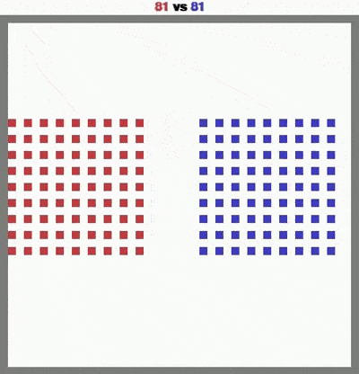
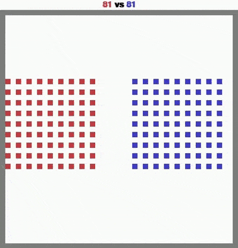
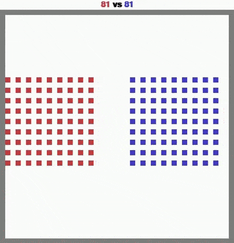
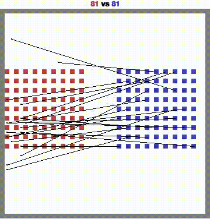
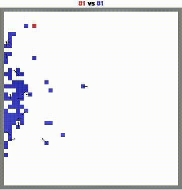
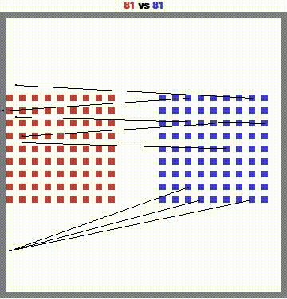

# MAgent2 RL Final Project
## Overview
This repository focuses on building, training, and evaluating intelligent agents to solve the `battle` environment in the Magent2 game. The goal is to develop agents that outperform existing ones, including `random`, `red`, and `final_red`.

## Methodology and Models
We implement and evaluate the following approaches for training agents:

1. Deep Q-Learning (DQL): A model trained against random agent.
2. Self-Play Deep Q-Learning: An enhanced DQL model leveraging self-play.  **(BEST)**
3. Proximal Policy Optimization (PPO): A deep neural network trained with PPO.

## Evaluation Strategy
Trained agents are evaluated against three types of opponents:
1. Random Agents: Agents that take random actions in the environment.
2. A Pretrained Agent: A pretrained agent provided in the repository.
3. A Final Agent: A stronger pretrained agent

## Agent Training with Functional Policy and Hyperparameter Reward

### Functional Policy
The agent's decision-making process is based on a **Functional Policy**, which uses mathematical functions or flexible models to map observations to actions. This approach allows the agent to:

- **Adapt to Complex Environments**: Quickly adjust to dynamic and unpredictable scenarios.
- **Optimize Decision-Making**: Enhance performance by leveraging sophisticated policy structures.

### Hyperparameter Reward Optimization
The reward system for the agent is tuned through hyperparameter optimization to guide learning effectively. Key aspects include:

- **step_reward**: reward after every step.
- **attack_opponent_reward**: reward added for attacking an opponent.
- **dead_penalty**: reward given to an agent when it gets eliminated (dies).

## Result

### Deep Q Model

#### Experiment 1

<table>
  <tr>
    <td>
      <ul>
        <li><strong>Trained Episode</strong>: 200</li>
        <li><strong>Training Time</strong>: 50 minutes</li>
        <li><strong>Result</strong>:</li>
      </ul>
      <table>
        <tr>
          <th>Opponent Type</th>
          <th>Win Rate</th>
        </tr>
        <tr>
          <td>Random Agent</td>
          <td>0.1</td>
        </tr>
        <tr>
          <td>Pretrained Red Agent</td>
          <td>1.0</td>
        </tr>
      </table>
    </td>
    <td>
      <div align="center">
        <h4>Play Against Pretrained Red Agent</h4>
        
      </div>
    </td>
  </tr>
</table>

#### Experiment 2

<table>
  <tr>
    <td>
      <ul>
        <li><strong>Environment Reward Hyperparameters</strong>:</li>
        <ul>
          <li><code>step_reward</code>: 0.001</li>
          <li><code>dead_penalty</code>: -0.1</li>
          <li><code>attack_penalty</code>: -0.05</li>
          <li><code>attack_opponent_reward</code>: 0.5</li>
        </ul>
        <li><strong>Trained Episode</strong>: 300</li>
        <li><strong>Training Time</strong>: 80 minutes</li>
        <li><strong>Result</strong>:</li>
      </ul>
      <table>
        <tr>
          <th>Opponent Type</th>
          <th>Win Rate</th>
        </tr>
        <tr>
          <td>Random Agent</td>
          <td>1.0</td>
        </tr>
        <tr>
          <td>Pretrained Red Agent</td>
          <td>1.0</td>
        </tr>
        <tr>
          <td>Final Red Agent</td>
          <td>1.0</td>
        </tr>
      </table>
    </td>
    <td>
      <div align="center">
        <h4>Play Against Final Red Agent</h4>
        
      </div>
    </td>
  </tr>
</table>

<table>
  <tr>
    <td align="left">
      <h4>Play Against Random Red Agent</h4>
      
    </td>
    <td align="left">
      <h4>Play Against Pretrained Red Agent (Red)</h4>
      
    </td>
  </tr>
</table>

### Self-play Deep Q Model

<p align="center">
  <table>
    <tr>
      <td align="center">
        <h4>Against Random Agent</h4>
        
      </td>
      <td align="center">
        <h4>Against Pretrained Agent</h4>
        
      </td>
      <td align="center">
        <h4>Against Final Agent</h4>
        
      </td>
    </tr>
  </table>
</p>


## Installation
clone this repo and install with
```
pip install -r requirements.txt
```

## Demos
See `final_training.py` for a training.

## Evaluation
Refer to `eval.py` for the evaluation code, you might want to modify it with your specific codebase.

## References

1. [MAgent2 GitHub Repository](https://github.com/Farama-Foundation/MAgent2)
2. [MAgent2 API Documentation](https://magent2.farama.org/introduction/basic_usage/)

For further details on environment setup and agent interactions, please refer to the MAgent2 documentation.
